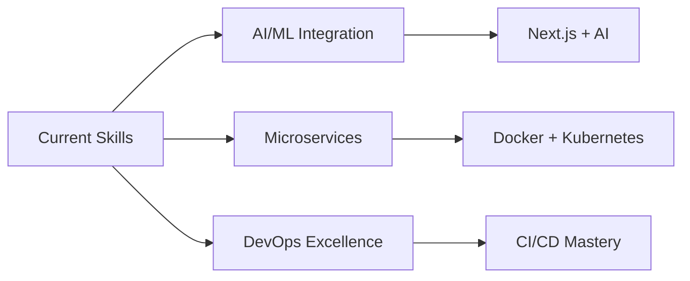

# ✨ Kevin Ardiansyah - Professional Developer Profile

<!-- Animated Header -->
<div align="center">
  
</div>

<!-- Dynamic Typing Animation -->
<div align="center">
  
</div>

<!-- Enhanced Profile Badges -->
<div align="center">
  
  
  
</div>

---

## 🎯 **Professional Overview**

```typescript
interface Developer {
  name: string;
  location: string;
  role: string;
  experience: string[];
  specialties: string[];
  currentMission: string;
  nextGoals: string[];
  philosophy: string;
}

const kevinArdiansyah: Developer = {
  name: "Kevin Ardiansyah",
  location: "🇮🇩 Tangerang, Banten, Indonesia",
  role: "Senior Fullstack Developer & Digital Architect",
  experience: ["5+ years in web development", "50+ projects delivered"],
  specialties: [
    "Laravel Ecosystem Mastery",
    "Next.js & React Architecture", 
    "Cloud-Native Solutions",
    "API Design & Integration",
    "Performance Optimization"
  ],
  currentMission: "Building next-generation web applications with modern tech stack",
  nextGoals: ["AI/ML Integration", "Microservices Architecture", "DevOps Excellence"],
  philosophy: "Code with purpose, design with passion, deliver with excellence ✨"
};
```

### 🌟 **What Sets Me Apart**

<table>
<tr>
<td width="33%" align="center">

**🎨 Frontend Excellence**
> Crafting intuitive, responsive interfaces that users love

</td>
<td width="33%" align="center">

**⚡ Backend Mastery**
> Building robust, scalable APIs and server architectures

</td>
<td width="33%" align="center">

**☁️ Cloud Integration**
> Deploying modern, secure, and performant cloud solutions

</td>
</tr>
</table>

---

## 🛠 **Technology Stack & Expertise**

### **Frontend Development**
<div align="center">


</div>

### **Backend Development**
<div align="center">


</div>

### **Database & Storage**
<div align="center">


</div>

### **Cloud & DevOps**
<div align="center">


</div>

---

## 📊 **GitHub Analytics & Performance**

<div align="center">
  
  <!-- GitHub Stats Cards -->
  
  
  
</div>

<div align="center">
  
  <!-- Language Stats & Activity Graph -->
  
  
</div>

<!-- GitHub Activity Graph -->
<div align="center">
  
</div>

## 🏆 **Achievements & Recognition**

<div align="center">
  
</div>

---

## 🎨 **Featured Projects & Portfolio**

<div align="center">

### 🌐 **[Kevin's Digital Workspace](https://kev-workspace.vercel.app)**

[](https://kev-workspace.vercel.app)
[](https://github.com/ouchycode)

</div>

<table>
<tr>
<td width="50%">

**🎯 Project Highlights:**
- ✨ Modern, responsive design with smooth animations
- 🚀 Built with Next.js 14 & App Router
- 🎨 Beautiful UI with Tailwind CSS & Framer Motion
- ⚡ Optimized performance & SEO
- 📱 Mobile-first responsive design

</td>
<td width="50%">

**🛠 Tech Stack:**
- Next.js 14 (App Router)
- TypeScript
- Tailwind CSS
- Framer Motion
- Vercel Deployment

</td>
</tr>
</table>

---

## 💼 **Professional Services**

<div align="center">

| 🎯 **Service** | 📋 **Description** | ⚡ **Delivery** |
|---|---|---|
| **Web Development** | Full-stack web applications with modern frameworks | 2-6 weeks |
| **API Development** | RESTful APIs and GraphQL endpoints | 1-3 weeks |
| **UI/UX Implementation** | Pixel-perfect, responsive interfaces | 1-4 weeks |
| **Cloud Deployment** | Scalable cloud infrastructure setup | 3-7 days |
| **Performance Optimization** | Speed and SEO optimization | 1-2 weeks |
| **Technical Consulting** | Architecture planning and code review | Flexible |

</div>

---

## 📈 **Current Learning Path**

<div align="center">



</div>

**🎯 2024 Goals:**
- 🤖 Integrate AI/ML capabilities into web applications
- 🏗️ Master microservices architecture patterns
- 🚀 Achieve DevOps certification and CI/CD excellence
- 📚 Contribute to open-source projects
- 🌟 Build a SaaS product from scratch

---

## 💭 **Daily Motivation**

<div align="center">
  
</div>

---

## 🤝 **Let's Connect & Collaborate**

<div align="center">

### 💼 **Professional Links**

[](https://kev-workspace.vercel.app)
[](mailto:kevin@example.com)
[](https://linkedin.com/in/kevin-ardiansyah)

### 🌟 **Social Media**

[](https://instagram.com/kevinnardd_)
[](https://instagram.com/kev.workspace)

</div>

<div align="center">

**📍 Based in:** Tangerang, Banten, Indonesia  
**🌍 Available for:** Remote work & global collaborations  
**💼 Status:** Open for freelance projects & partnerships  
**⏰ Response time:** Within 24 hours

</div>

---

<div align="center">

### 🙏 **Thank You for Visiting!**

*⭐ If you find my work interesting, please consider starring my repositories!*  
*💬 Feel free to reach out for collaborations or just a friendly chat about tech!*


</div>
